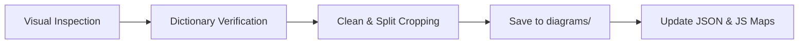

# STEM Dictionary Diagram Mapping & Batch Processing Guide

This document records the exact procedure used to map, crop, verify, and integrate user-captured textbook screenshots into the Osmosis Game engine.

---

## 1. Why This Workflow Outperforms OCR & Generic AI Studio
- **Complete Labels**: Previous automated vector/OCR scripts chopped off labels (e.g. cutting off *Centrum*, *Neural spine* on vertebrae). User screenshots contain full, pristine labels.
- **Zero Hallucination / Drift**: AI Studio web uploads often hallucinate bounding boxes or swap file paths (e.g. assigning a lens aberration diagram to *abomasum*).
- **Direct Dictionary Verification**: Every extracted caption is verified 1:1 against valid entries in `dictionary.json`.

---

## 2. Standard 5-Step Batch Workflow

1. **Visual Inspection**:
   - Inspect screenshot using high-resolution vision.
   - Read diagram title, subfigure captions (Fig 1, Fig 2), and key labels.
2. **Dictionary Cross-Reference**:
   - Match caption to canonical headwords, raw headwords, and synonyms in `dictionary.json`.
3. **Precision Crop & Multi-Figure Splitting**:
   - Strip textbook horizontal rule lines from top/bottom borders.
   - When a screenshot contains multiple figures (e.g., Astigmatism + Distortion), split them into separate images so each dictionary term gets its own dedicated, focused visual.
4. **Standardized Image Output**:
   - Save high-quality PNGs to `diagrams/dict_<headword>.png`.
5. **Atomic Mapping Updates**:
   - Update `dictionary_diagrams_map.json`.
   - Update `core_dictionary_diagrams.js` (`var DictionaryDiagrams = { ... }`).

---

## 3. Batch Tracking

### Batch 1 (Completed) — Screenshots 1 to 10
Source Folder: `section a-b images/`

| # | Source Screenshot | Diagram Content / Caption | Generated Diagram File(s) | Mapped Dictionary Term(s) |
|---|---|---|---|---|
| 1 | `Screenshot 2026-08-03 161441.png` | Axis vertebra of a mammal (Lateral & Anterior) | `dict_axis_vertebra.png` | `axis`, `axis vertebra` |
| 2 | `Screenshot 2026-08-03 161817.png` | Chemical Structure of Azo Dye | `dict_azo_compound.png`, `dict_azo_dye.png` | `azo compound`, `azo dye` |
| 3 | `Screenshot 2026-08-03 161835.png` | Parabola with line of symmetry & equation | `dict_axis_of_symmetry.png` | `axis of symmetry` |
| 4 | `Screenshot 2026-08-03 162009.png` | Fig 1: Astigmatism / Fig II: Distortion | `dict_astigmatism.png`, `dict_distortion.png` | `astigmatism`, `distortion`, `distortion aberration` |
| 5 | `Screenshot 2026-08-03 162107.png` | Fig III: Chromatic / Fig IV & V: Spherical | `dict_chromatic_aberration.png`, `dict_spherical_aberration.png`, `dict_aberration.png` | `aberration`, `chromatic aberration`, `spherical aberration` |
| 6 | `Screenshot 2026-08-03 162120.png` | Fig VI: Blue light focus vs Red light focus | `dict_chromatic_aberration_focus.png` | `chromatic aberration` |
| 7 | `Screenshot 2026-08-03 162141.png` | ABO Blood Group System Table | `dict_abo_blood_group_system.png`, `dict_abo_blood_group.png` | `abo blood group system`, `blood group` |
| 8 | `Screenshot 2026-08-03 162157.png` | Abomasum (true stomach) of a cow | `dict_abomasum.png`, `dict_abomasum_true_stomach.png` | `abomasum`, `abomasum (true stomach)` |
| 9 | `Screenshot 2026-08-03 162218.png` | Line absorption spectrum setup | `dict_absorption_spectrum.png` | `absorption spectrum` |
| 10 | `Screenshot 2026-08-03 162233.png` | Instantaneous Acceleration Graph (v-t curve) | `dict_acceleration_time_graph.png`, `dict_instantaneous_acceleration.png` | `acceleration`, `acceleration-time-graph`, `instantaneous acceleration` |

---

### Batch 2 (Completed) — Screenshots 11 to 20
Source Folder: `section a-b images/`

| # | Source Screenshot | Diagram Content / Caption | Generated Diagram File(s) | Mapped Dictionary Term(s) |
|---|---|---|---|---|
| 11 | `Screenshot 2026-08-03 162247.png` | Constant Acceleration-Time Graph | `dict_acceleration_time_graph_constant.png`, `dict_acceleration_time_graph.png` | `acceleration-time graph`, `acceleration time graph` |
| 12 | `Screenshot 2026-08-03 162308.png` | Displacement vs t² graph | `dict_acceleration_due_to_gravity.png` | `acceleration due to gravity` |
| 13 | `Screenshot 2026-08-03 162326.png` | Base Station System (BSS) Architecture | `dict_base_station_system.png`, `dict_bss.png` | `base station system`, `base station system (bss)`, `bss`, `base station controller` |
| 14 | `Screenshot 2026-08-03 162355.png` | Chemical structure of acetanilide | `dict_acetanilide.png`, `dict_acetanilide_n_phenylethanamide.png` | `acetanilide`, `acetanilide (n-phenylethanamide)`, `n-phenylethanamide` |
| 15 | `Screenshot 2026-08-03 162409.png` | 2D molecular structure of acetaldehyde | `dict_acetaldehyde.png` | `acetaldehyde`, `ethanal` |
| 16 | `Screenshot 2026-08-03 162423.png` | Chemical structure of acetamide | `dict_acetamide.png`, `dict_acetamide_ethanamide.png` | `acetamide`, `acetamide (ethanamide)`, `ethanamide` |
| 17 | `Screenshot 2026-08-03 162440.png` | Chemical structure of acetylacetone (tautomers) | `dict_acetylacetone.png` | `acetylacetone`, `pentane-2,4-dione` |
| 18 | `Screenshot 2026-08-03 162453.png` | Chemical structure of acetophenone | `dict_acetophenone.png` | `acetophenone`, `phenylethanone` |
| 19 | `Screenshot 2026-08-03 162508.png` | Acetylation reaction (Pyruvate to Acetyl CoA) | `dict_acetylation.png`, `dict_acetylation_ethanoylation.png` | `acetylation`, `acetylation (ethanoylation)`, `ethanoylation` |
| 20 | `Screenshot 2026-08-03 162521.png` | Structure of acetylcholine (neurotransmitter) | `dict_acetylcholine.png`, `dict_acetylcholine_ach.png` | `acetylcholine`, `acetylcholine (ach)`, `ach` |

---

### Batch 3 & 4 (Completed) — Screenshots 21 to 40
Source Folder: `section a-b images/`

| # | Source Screenshot | Diagram Content / Caption | Generated Diagram File(s) | Mapped Dictionary Term(s) |
|---|---|---|---|---|
| 21 | `Screenshot 2026-08-03 162637.png` | Chemical structure of Acetyl-CoA | `dict_acetyl_coa.png`, `dict_acetyl_coenzyme_a_acetyl_coa.png` | `acetyl coenzyme a`, `acetyl-coa`, `acetyl coa` |
| 22 | `Screenshot 2026-08-03 162648.png` | Achromatic Lens | `dict_achromatic_lens.png`, `dict_achromat.png` | `achromatic lens`, `achromat` |
| 23 | `Screenshot 2026-08-03 162714.png` | Chemical Structure of Acid Anhydride | `dict_acid_anhydride.png` | `acid anhydride` |
| 24 | `Screenshot 2026-08-03 162725.png` | Chemical structure of acrylamide | `dict_acrylamide.png` | `acrylamide` |
| 25 | `Screenshot 2026-08-03 162733.png` | Chemical Structure of Acrylonitrile | `dict_acrylonitrile.png`, `dict_acrylonitrile_propenenitrile.png`, `dict_propenenitrile.png` | `acrylonitrile`, `propenenitrile`, `acrylic` |
| 26 | `Screenshot 2026-08-03 162744.png` | Activation energy / SN2 reaction coordinate | `dict_activation_energy.png`, `dict_reaction_coordinate.png`, `dict_transition_state.png` | `activation energy`, `reaction coordinate`, `transition state` |
| 27 | `Screenshot 2026-08-03 162804.png` | Activity Series of Metals in Aqueous Solution | `dict_activity_series.png`, `dict_reactivity_series.png`, `dict_electrochemical_series.png` | `activity series`, `reactivity series`, `electrochemical series` |
| 28 | `Screenshot 2026-08-03 162814.png` | Structure of an acuminate leaf | `dict_acuminate.png`, `dict_acuminate_leaf.png` | `acuminate`, `acuminate leaf` |
| 29 | `Screenshot 2026-08-03 162822.png` | Acute angle (54°) | `dict_acute_angle.png` | `acute angle` |
| 30 | `Screenshot 2026-08-03 162834.png` | Chemical Structure of Acyclovir | `dict_acyclovir.png` | `acyclovir` |
| 31 | `Screenshot 2026-08-03 162845.png` | Collisions from random frequency hopping | `dict_adaptive_frequency_hopping.png`, `dict_frequency_hopping.png` | `adaptive frequency hopping`, `frequency hopping` |
| 32 | `Screenshot 2026-08-03 162858.png` | Adaxial & Abaxial leaf surfaces | `dict_adaxial.png`, `dict_abaxial.png` | `adaxial`, `abaxial` |
| 33 | `Screenshot 2026-08-03 162910.png` | Addition of Vectors (Triangle law) | `dict_addition_of_vectors.png`, `dict_vector_addition.png` | `addition of vectors`, `vector addition` |
| 34 | `Screenshot 2026-08-03 162919.png` | Chemical Structure of Adenosine Triphosphate (ATP) | `dict_adenosine_triphosphate.png`, `dict_atp.png` | `adenosine triphosphate`, `adenosine triphosphate (atp)`, `atp` |
| 35 | `Screenshot 2026-08-03 162927.png` | Chemical Structure of Adipic Acid | `dict_adipic_acid.png`, `dict_hexanedioic_acid.png` | `adipic acid`, `hexanedioic acid` |
| 36 | `Screenshot 2026-08-03 162934.png` | Adipocyte (Fat Cell) anatomical cross-section | `dict_adipocyte.png`, `dict_adipocyte_fat_cell.png`, `dict_fat_cell.png` | `adipocyte`, `adipocyte (fat cell)`, `fat cell` |
| 37 | `Screenshot 2026-08-03 162941.png` | Adjacent angles & Adjacent of right triangle | `dict_adjacent_angles.png`, `dict_adjacent.png`, `dict_adjacent_side.png` | `adjacent`, `adjacent angles`, `adjacent side` |
| 38 | `Screenshot 2026-08-03 162948.png` | Chemical Structure of Adrenaline | `dict_adrenaline.png`, `dict_epinephrine.png` | `adrenaline`, `epinephrine` |
| 39 | `Screenshot 2026-08-03 211010.png` | Chemical structure of Aflatoxin B1 | `dict_aflatoxin.png`, `dict_aflatoxin_b1.png` | `aflatoxin`, `aflatoxin b1` |
| 40 | `Screenshot 2026-08-03 211033.png` | Air layering (marcotting) 4-step process | `dict_air_layering.png`, `dict_air_layering_marcotting.png`, `dict_marcotting.png` | `air layering`, `air layering (marcotting)`, `marcotting` |

---

### Batch 5 (Queued) — Screenshots 41 to 60
Source Folder: `section a-b images/`

- `Screenshot 2026-08-03 211050.png`
- `Screenshot 2026-08-03 211113.png`
- `Screenshot 2026-08-03 211140.png`
- `Screenshot 2026-08-03 211200.png`
- `Screenshot 2026-08-03 211219.png`
- `Screenshot 2026-08-03 211232.png`
- `Screenshot 2026-08-03 211240.png`
- `Screenshot 2026-08-03 211254.png`
- `Screenshot 2026-08-03 211321.png`
- `Screenshot 2026-08-03 211341.png`
- `Screenshot 2026-08-03 211349.png`
- `Screenshot 2026-08-03 211401.png`
- `Screenshot 2026-08-03 211408.png`
- `Screenshot 2026-08-03 211416.png`
- `Screenshot 2026-08-03 211426.png`
- `Screenshot 2026-08-03 211439.png`
- `Screenshot 2026-08-03 211510.png`
- `Screenshot 2026-08-03 211525.png`
- `Screenshot 2026-08-03 211534.png`
- `Screenshot 2026-08-03 211544.png`

---

## 4. Quality Standards
1. **Pristine Author Framing**: High-resolution user captures preserved with complete clarity.
2. **Dual Map Consistency**: `dictionary_diagrams_map.json` and `core_dictionary_diagrams.js` remain synchronized and sorted.

