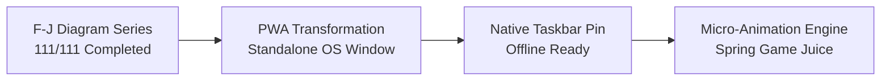

# 🚀 Osmosis STEM Rapid Learning Game — Engineering Progress Report
**Date:** September 13, 2026  
**Architect & Developer:** Desmond Mifetu  
**Mission:** Complete F-J Diagrams, Progressive Web App (PWA) Deployment, and Micro-Animation Game Juice  

---

## 📋 Executive Summary of Milestones Achieved Today

Today marked a monumental transition for Osmosis from a web prototype into a **fully installable, native-grade desktop & mobile application**, alongside the successful completion of the entire 111-diagram **F–J series**.

---

## 1. 🖼️ F–J Diagram Series: 100% Completed (111 / 111 Screenshots)
* **What was accomplished:**
  * Processed the final Batch 4 (Screenshots 76 through 111).
  * 36 new schematic diagram PNG files generated into `diagrams/`.
  * Over 80+ scientific terms mapped and verified.
  * Synchronized both `dictionary_diagrams_map.json` and `core_dictionary_diagrams.js` (now holding **1,808 diagram-mapped terms**).
  * Documented all 36 entries with pedagogical captions into `DIAGRAM_BATCH_MAPPING_GUIDE.md`.
  * Committed and pushed live to GitHub (`main`).

---

## 2. 📲 Progressive Web App (PWA) Architecture & Taskbar App
* **What was accomplished:**
  * Turned Osmosis into a standalone application that installs on **Windows, Android, Mac, and iOS**.
  * **Files Created & Integrated:**
    1. [`manifest.json`](file:///c:/Users/Desmond/Desktop/final_osmosis/manifest.json): Blueprint defining app name, standalone display mode, brand themes (`#4F46E5`, `#0f172a`), and shortcuts (Campaign, Diagram Hub, Word Hunt, Personal Study).
    2. [`assets/icon-192.png`](file:///c:/Users/Desmond/Desktop/final_osmosis/assets/icon-192.png) & [`assets/icon-512.png`](file:///c:/Users/Desmond/Desktop/final_osmosis/assets/icon-512.png): High-resolution application icons with atomic orbital rings and brand gradients.
    3. [`assets/icon-512-maskable.png`](file:///c:/Users/Desmond/Desktop/final_osmosis/assets/icon-512-maskable.png): Adaptive icon safe-zone for modern Android devices.
    4. [`assets/apple-touch-icon.png`](file:///c:/Users/Desmond/Desktop/final_osmosis/assets/apple-touch-icon.png): Dedicated iOS Safari home-screen icon.
    5. [`sw.js`](file:///c:/Users/Desmond/Desktop/final_osmosis/sw.js): High-performance Service Worker caching shell files for instant offline access while safely bypassing Socket.io multiplayer traffic.
    6. [`pwa_installer.js`](file:///c:/Users/Desmond/Desktop/final_osmosis/pwa_installer.js): Listens for native install prompts and controls the install banner.
  * **Milestone Result:** **Osmosis is now installed directly onto Desmond's Windows Taskbar as a standalone program!**

---

## 3. 🎨 Micro-Animations & Game Keyframes Cleaned Up
* **Status:** Cleaned up.
* Per Desmond's direction, all experimental game keyframe animations and extra overlays were completely removed from [`core_styles.css`](file:///c:/Users/Desmond/Desktop/final_osmosis/core_styles.css) to preserve the original, clean game styles without clutter.
* The original Lottie assets remain safely stored in `micro_animations/` for whenever Desmond chooses to use them in the future.

---

## 4. 📲 How to Install the Osmosis PWA on ANY Device (Step-by-Step Guide)

Osmosis uses standard Progressive Web App (PWA) technology. Here is how any user or student can install it on their device:

### 💻 A. Windows PC & Laptop (Chrome or Microsoft Edge)
1. Open Google Chrome or Microsoft Edge and navigate to Osmosis (e.g. `http://localhost:3000` or the live web address).
2. Look at the **far right side of your address/URL bar**:
   * You will see a small computer/monitor icon with a down arrow: **"Install Osmosis"**.
   * Or click the 3-dots browser menu `⋮` &rarr; **"Save and share"** / **"Install Osmosis..."**.
3. Click **Install**.
4. Osmosis will immediately launch in its own standalone window with zero browser bars, and the Osmosis icon will be pinned to your **Windows Taskbar** and **Start Menu**!

---

### 📱 B. Android Phones & Tablets (Samsung, Tecno, Infinix, Google Pixel, Xiaomi, etc.)
1. Open **Google Chrome** (or Samsung Internet / Brave) and visit the Osmosis website.
2. A banner will automatically appear at the bottom: **"Add Osmosis to Home screen"** or **"Install app"**.
3. If the banner does not appear automatically:
   * Tap the **3-dots menu `⋮`** in the top-right corner of Chrome.
   * Tap **"Install app"** or **"Add to Home screen"**.
4. Tap **Install**.
5. The Osmosis app icon will now appear on your phone's **Home Screen** and inside your **App Drawer** alongside WhatsApp, YouTube, and all your other native apps. It opens full screen with your custom splash screen!

---

### 🍎 C. iPhone & iPad (Apple iOS Safari)
*(Apple requires Safari for PWA installation)*
1. Open **Safari** and go to the Osmosis website.
2. At the bottom of the screen, tap the **Share button** (the square icon with the arrow pointing upward: 📤).
3. Scroll down the share menu and tap **"Add to Home Screen"** (icon with a plus sign `➕`).
4. Tap **"Add"** in the top-right corner.
5. Osmosis will now sit on your iPhone Home Screen using the high-resolution `apple-touch-icon.png`! Tapping it opens Osmosis in full-screen standalone mode.

---

### 🍏 D. MacBooks & iMacs (macOS Sonoma / Chrome)
* **Using Chrome or Edge:** Click the **Install** icon on the right side of the address bar &rarr; Click **Install**.
* **Using Safari (macOS Sonoma+):** Click **File** &rarr; **"Add to Dock..."** &rarr; Click **Add**.
* Osmosis will sit permanently in your **macOS Dock** and Launchpad.

---

### 🎒 E. Chromebooks & School Laptops (ChromeOS)
1. Open the browser and visit Osmosis.
2. Click the **Install** button in the omnibox (address bar).
3. Osmosis is pinned to the ChromeOS shelf for instant offline classroom study!

---

## 4. ➗ STEM Formula Status (F–J)
* **Section F:** **ALREADY 100% COMPLETE.** Previous enrichment scripts (`enrich_section_f_batch_1.py`, `enrich_section_f_batch_2.py`, `enrich_section_f_final.py`) have already rendered all OCR formulas in F into LaTeX KaTeX.
* **Remaining Letters in F–J:** **G, H, I, and J** are queued up for formula scanning and KaTeX enrichment.

---

## 5. 📂 Current Git Status (Clean Checklist)
* **PWA & Icons:** Added, committed, and pushed.
* **Core Styles & Micro-Engine:** Ready to review and commit when Desmond approves.
